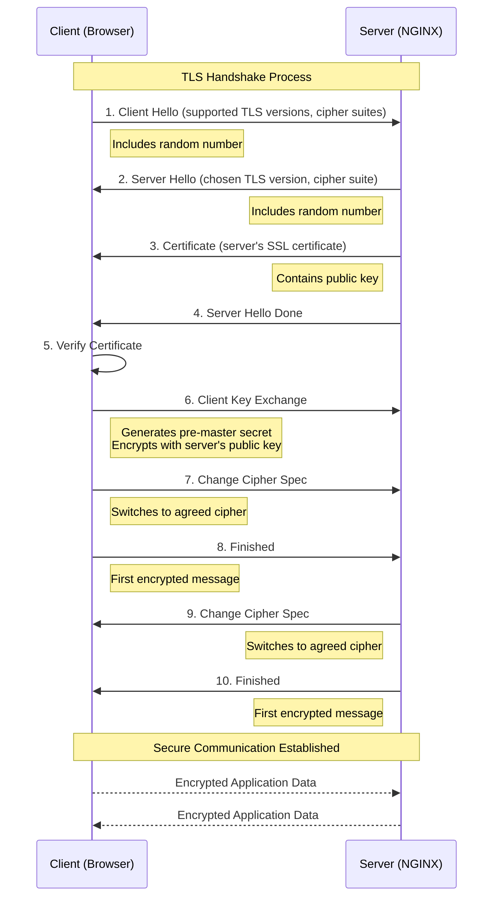

# Inception
## Project Overview
This project focuses on system administration using Docker to create and configure a small infrastructure composed of different services. The entire setup must be done within a virtual machine using Docker Compose.
## Infrastructure Components
### Services
- NGINX: Web server with TLSv1.2/TLSv1.3 configuration
- WordPress + php-fpm: Content Management System
- MariaDB: Database server
- Docker Network: For container communication
### Storage
- Volume 1: maiadb database
- Volume 2: WordPress website files
### Project Structure
```bash
.
├── Makefile
├── secrets/
│   ├── credentials.txt
│   ├── db_password.txt
│   └── db_root_password.txt
└── srcs/
    ├── docker-compose.yml
    ├── .env
    └── requirements/
        ├── mariadb/
        │   ├── conf/
        │   ├── tools/
        │   ├── Dockerfile
        │   └── .dockerignore
        ├── nginx/
        │   ├── conf/
        │   ├── tools/
        │   ├── Dockerfile
        │   └── .dockerignore
        └── wordpress/
            ├── conf/
            ├── tools/
            ├── Dockerfile
            └── .dockerignore
```

_Now I'll explain each service in this project in a clear and simple way:_

1 - Nginx

- **What it is:** A web server and reverse proxy
- **Role in project:**
  - Acts as the main entry point for all web traffic
  - Handles HTTPS connections with TLS encryption
  - Forwards requests to the WordPress container
- **Why we use it:**
  - It's fast and efficient at serving web content
  - Great for handling SSL/TLS encryption
  - Works well as a reverse proxy to direct traffic to other services

_In the explanation above, we went through some concepts. We aim to provide you with a clear explanation, such as what a reverse proxy is, why it is used, and what TLS/SSL encryption entails_
**Reverse Proxy**
A reverse proxy is a server that sits in front of web servers and forwards client (e.g. web browser) requests to those web servers. Reverse proxies are typically implemented to help increase security, performance, and reliability.

Below we outline some of the benefits of a reverse proxy:
- **Load balancing** : A popular website that gets millions of users every day may not be able to handle all of its incoming site traffic with a single origin server. Instead, the site can be distributed among a pool of different servers, all handling requests for the same site. In this case, a reverse proxy can provide a load balancing solution which will distribute the incoming traffic evenly among the different servers to prevent any single server from becoming overloaded. In the event that a server fails completely, other servers can step up to handle the traffic.
- **Protection from attacks** : With a reverse proxy in place, a web site or service never needs to reveal the IP address of their origin server(s). This makes it much harder for attackers to leverage a targeted attack against them, such as a DDoS attack. Instead the attackers will only be able to target the reverse proxy, such as Cloudflare’s CDN, which will have tighter security and more resources to fend off a cyber attack.
- **Caching** : A reverse proxy can also cache content, resulting in faster performance. For example, if a user in Paris visits a reverse-proxied website with web servers in Los Angeles, the user might actually connect to a local reverse proxy server in Paris, which will then have to communicate with an origin server in L.A. The proxy server can then cache (or temporarily save) the response data. Subsequent Parisian users who browse the site will then get the locally cached version from the Parisian reverse proxy server, resulting in much faster performance.
- **SSL encryption** : Encrypting and decrypting SSL (or TLS) communications for each client can be computationally expensive for an origin server. A reverse proxy can be configured to decrypt all incoming requests and encrypt all outgoing responses, freeing up valuable resources on the origin server.

### SSL/TLS encryption :
SSL/TLS stands for Secure Sockets Layer and Transport Layer Security. It is a communication protocol that ensures safe interactions between computer systems over the internet. SSL/TLS certificates enable web browsers to verify and create encrypted connections with websites using the SSL/TLS protocol.
#### SSL/TLS Handshake Process:

